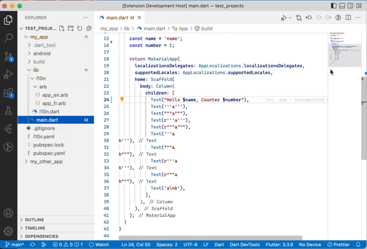

# L10nization README

"Lionization" is a tool for extracting text to arb files in a Flutter application.

## Features

1. You must select the text with the quotes (like "Hello World").
1. In the action code you will find `Extract 'Hello World' to arb files`.
1. You can change the name of the `key` via the command.

## Release Notes

For full release notes, see the [changelog](CHANGELOG.md).
